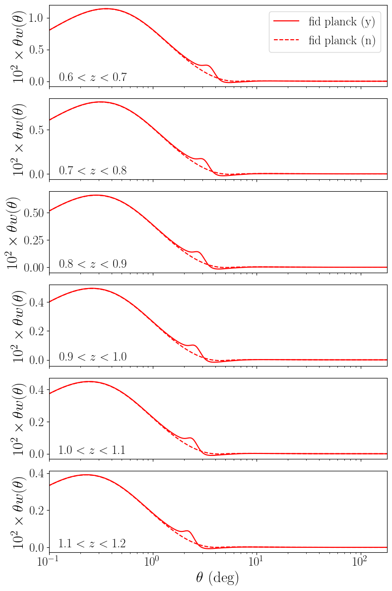
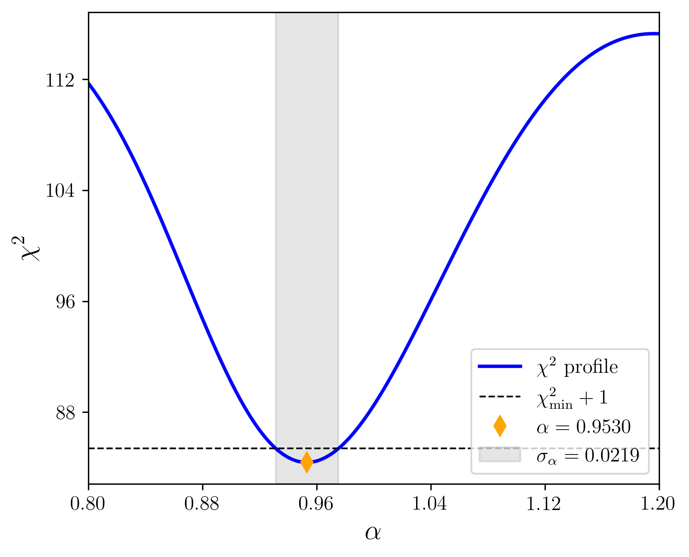

# BAOfit_wtheta

`BAOfit_wtheta` is a Python-based code designed to perform Baryon Acoustic Oscillation (BAO) fits using the angular two-point correlation function, $w(\theta)$, as the data vector.

## Description
 
The code implements a template-based method to model the $w(\theta)$ as

$w_{\rm model}(\theta,\boldsymbol{\Theta}) = B w_{\rm ref}(\alpha \theta) + \sum_i A_i \theta^{-i},$

where $B$ is the amplitude, $\alpha$ is the dilation parameter, and $A_i$ are the broad-band term parameters. $w_{\rm ref}(\theta)$ is the theoretical angular correlation function computed at a reference cosmology. The dilaton parameter can be expressed as

$\alpha(z_{\rm eff})=\left[D_M(z_{\rm eff})/r_d\right]\cdot\left[D_M(z_{\rm eff})/r_d\right]_{\rm ref}^{-1}$,

where $z_{\rm eff}$ is the effective redshift of the galaxy sample, $D_M(z)$ is the comoving angular diameter distance and $r_d$ is the sound horizon scale at the drag epoch.

- **Theoretical Template**
  
  The theoretical angular correlation function, $w_{\rm ref}(\theta)$, is derived directly from the power spectrum, $P(k, \mu)$, which we separate into a **wiggle** ($P_{\rm lin} - P_{nw}$) and a **no-wiggle** ($P_{nw}$) component:
  
  $P(k, \mu) = (b + \mu^2 f)^2 \left[ (P_{\rm lin} - P_{\rm nw}) e^{-k^2 \Sigma^2} + P_{\rm nw} \right],$
  
  where $b$ is the linear galaxy bias, and $f$ is the growth rate. The wiggle component is smoothed anisotropically via the damping parameter $\Sigma$. Both the wiggle and no-wiggle components of the power spectrum are computed using [`cosmoprimo`](https://github.com/cosmodesi/cosmoprimo/).

  The calculation of the theoretical $w(\theta)$ is split into three distinct components: one that depends quadratically on the linear galaxy bias, another one that depends linearly and one that has no dependency at all. The code saves individual files for each of these components:

  $w(\theta)=b^2w_{\rm bb}(\theta)+bw_{\rm bf}(\theta)+w_{\rm ff}(\theta)$.

- **Minimization Algorithm**
  
  For a fixed value of $\alpha$, the amplitude parameters are estimated minimizing a $\chi^2$ function that computes analytically the broad-band term parameters at each step of the minimization process (i.e., the $A_i$ parameters are completetly determined given $\alpha$ and $B$).
  The fit is performed using the stacking of the $w(\theta)$ for all the redshift bins and using a covariance matrix that includes cross-covariances between redshift bins.

## Features

- Compute the theoretical template for any custom cosmology and any set of redshift distributions.
- Fit the linear galaxy bias. The fitted values can be used as an input for the BAO-fitting model.
- Run BAO fits with different settings (e.g., removing any number of redshift bins, changing the scale cuts or binning in $\theta$, using a template without BAO wiggles, ...).

## Organization

- `utlis_cosmology.py` returns the cosmological parameters for a given cosmology.
- `utils_data.py` returns the redshift distributions, data $w(\theta)$ and covariance for a given dataset.
- `utils_template.py` computes the theoretical template for the $w(\theta)$.
- `utils_baofit.py` runs the BAO fits.

## Examples

- $w(\theta)$ template

    
    
<strong>Figure 1:</strong> Example of a template $w(\theta)$ computed using the DES Y6 BAO fiducial redshift distributions and Planck cosmology.

- $\chi^2$ profile

    
    
<strong>Figure 2:</strong> Example of a $\chi^2$ profile using DES Y6 as dataset.

